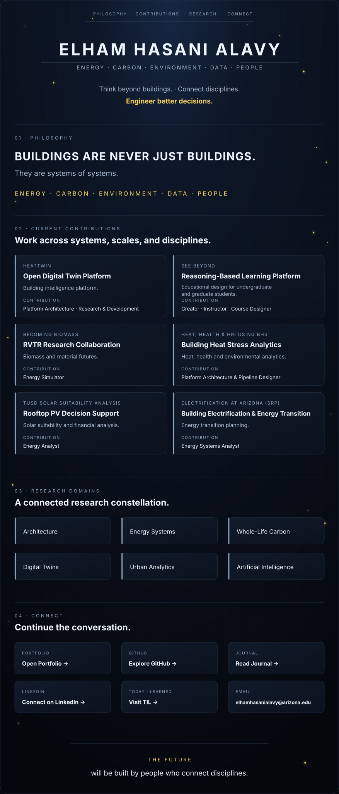

CLICKABLE LINKS

Accessible text version

## Philosophy

**Buildings are never just buildings.** They are systems of systems: energy, carbon, environment, data, and people.

## Current Contributions

- **HeatTwin — Open Digital Twin Platform:** Building intelligence platform. Contribution: Platform Architecture · Research & Development.
- **See Beyond — Reasoning-Based Learning Platform:** Reasoning-based educational design for undergraduate and graduate students. Contribution: Creator · Instructor · Course Designer.
- **Becoming Biomass — RVTR Research Collaboration:** Biomass and material futures. Contribution: Energy Simulator.
- **Heat, Health & HRI using BHS — Building Heat Stress Analytics:** Heat, health, and environmental analytics. Contribution: Platform Architecture & Pipeline Designer.
- **TUSD Solar Suitability Analysis — Rooftop PV Decision Support:** Solar suitability and financial analysis. Contribution: Energy Analyst.
- **Electrification at Arizona (SRP):** Building electrification and energy-transition planning. Contribution: Energy Systems Analyst.

## Research Domains

Architecture · Energy Systems · Whole-Life Carbon · Digital Twins · Urban Analytics · Artificial Intelligence

