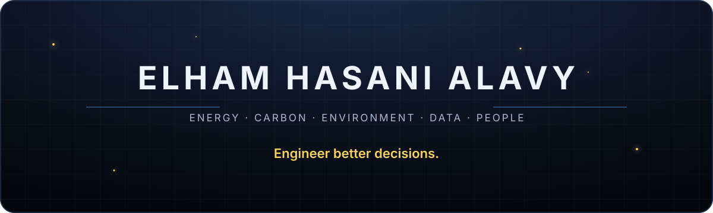

<div align="center">



### Buildings are never just buildings.

I work where **architecture, energy systems, climate resilience, geospatial analysis, and data** meet—building research pipelines and decision tools for complex environmental problems.

[Explore my work](https://elham-alavy.github.io/portfolio) · [Read my journal](https://elham-alavy.github.io/elham-journal/) · [Today I Learned](https://elham-alavy.github.io/TodayILearned/) · [Connect on LinkedIn](https://www.linkedin.com/in/elhamhasanialavy)

</div>

---

## What I’m building now

### Heat, Health & the Built Environment

An environmental-health pipeline connecting satellite land-surface temperature, parcel-level cooling data, health outcomes, and physiological heat-strain estimation across Arizona communities.

`Remote Sensing` `Spatial Analysis` `Environmental Health` `R` `Google Earth Engine`

### Thermal Twin

A building-intelligence platform for connecting energy performance, environmental conditions, and digital-twin workflows.

`Digital Twins` `Building Energy` `Data Pipelines` `Research & Development`

### See Beyond

A reasoning-based learning platform designed for undergraduate and graduate learners—not to supply answers, but to make thinking visible.

`Learning Design` `AI Literacy` `Reasoning` `Higher Education`

---

## Research constellation

```text
Architecture ───── Building Energy ───── Whole-Life Carbon
      │                    │                     │
Climate Resilience ─ Geospatial Data ─── Digital Twins
                           │
                 Better public decisions
```

---

## Selected work

- **[BHS Project](https://github.com/elham-alavy/BHS_project)** — heat exposure, environmental health, remote sensing, and spatial epidemiology.
- **[Academic Portfolio](https://elham-alavy.github.io/portfolio)** — research, analysis, and selected project outcomes.
- **[Today I Learned](https://elham-alavy.github.io/TodayILearned/)** — concise notes from ongoing technical and intellectual work.

---

<div align="center">

### The future will be built by people who connect disciplines.

[Email](mailto:elhamhasanialavy@arizona.edu) · [GitHub](https://github.com/elham-alavy) · [LinkedIn](https://www.linkedin.com/in/elhamhasanialavy)

</div>
