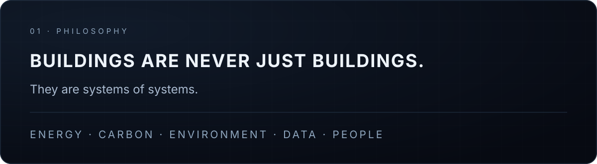
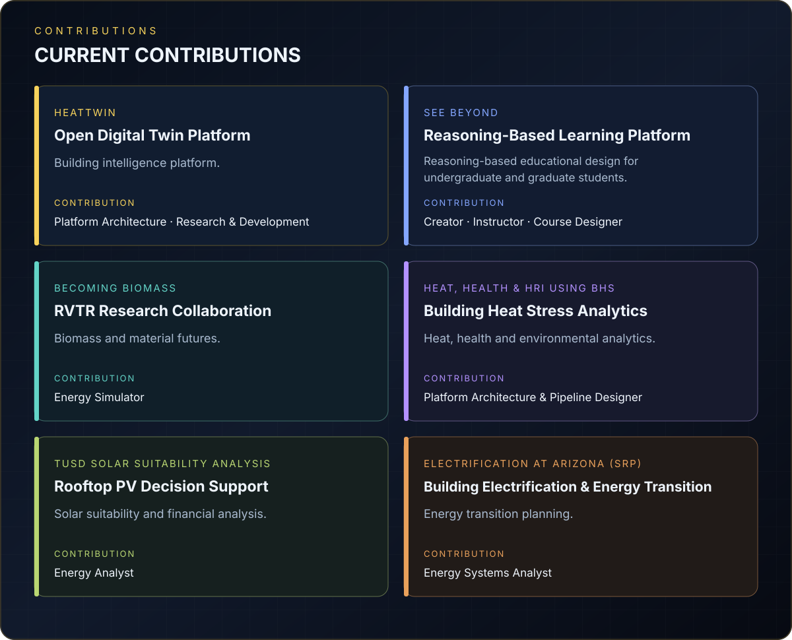
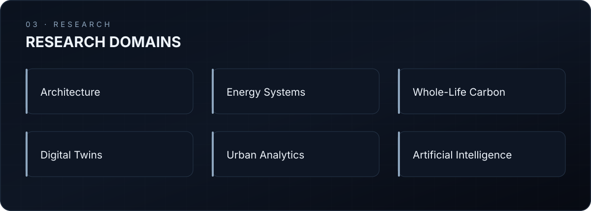
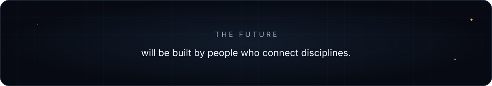

### Think beyond buildings. Connect disciplines. <strong>Engineer better decisions.</strong>

[Philosophy](#philosophy) · [Contributions](#current-contributions) · [Research](#research-domains) · [Connect](#connect)

