 
 
 
 

Accessible text version

## Current Contributions

- **HeatTwin — Open Digital Twin Platform:** Building intelligence platform. Contribution: Platform Architecture · Research & Development.
- **Course Development (CAPLA) — Reasoning-Based Learning Platform:** Reasoning-based educational design for undergraduate and graduate students. Contribution: Course Designer.
- **Becoming Biomass — RVTR Research Collaboration:** Biomass and material futures. Contribution: Energy Simulator.
- **Heat, Health & HRI using BHS — Building Heat Stress Analytics:** Heat, health, and environmental analytics. Contribution: Platform Architecture & Pipeline Designer.
- **TUSD Solar Suitability Analysis (JWJ) — Rooftop PV Decision Support:** Solar suitability and financial analysis. Contribution: Energy Analyst.
- **Electrification at Arizona (SRP):** Building electrification and energy-transition planning. Contribution: Energy Systems Analyst.

## Research Domains

Architecture · Energy Systems · Whole-Life Carbon · Digital Twins · Urban Analytics · Artificial Intelligence

