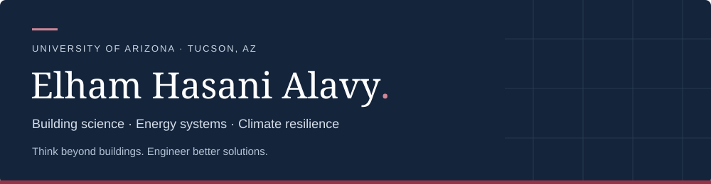

  <a href="https://elham-alavy.github.io/portfolio/"><strong>Personal website ↗</strong></a> &nbsp; · &nbsp;
  <a href="https://www.linkedin.com/in/elhamhasanialavy">LinkedIn</a> &nbsp; · &nbsp;
  <a href="mailto:elhamhasanialavy@arizona.edu">Email</a> &nbsp; · &nbsp;
  <a href="https://elham-alavy.github.io/elham-journal/">Journal</a>

## About

I'm a data and research engineer at the **University of Arizona**, working across environmental science, building science, and data analysis. I explore how buildings and environmental systems shape climate resilience and human well-being, and develop analytical tools and research platforms to support that work.

## Research interests

**Buildings & energy** — Building science, energy systems, and whole-life carbon. 
**Climate & health** — Heat science, climate resilience, and environmental health. 
**Data & digital systems** — Digital twins, urban analytics, and artificial intelligence.

## Current contributions

| Project | Focus | My contribution |
| :--- | :--- | :--- |
| **HeatTwin** | Open digital twin platform for building intelligence | Platform Architecture · Research & Development |
| **Heat, Health & HRI using BHS** | Building heat stress analytics | Platform Architecture & Pipeline Design |
| **TUSD Solar Suitability Analysis (JWJ)** | Rooftop PV decision support | Energy Analysis |
| **Electrification at Arizona (SRP)** | Building electrification and energy-transition planning | Energy Systems Analysis |
| **Becoming Biomass · RVTR** | Biomass and material futures | Energy Simulation |
| **Course Development · CAPLA** | Reasoning-based educational design | Course Design |

These project repositories are available to contributors. [Explore the project overview on my website →](https://elham-alavy.github.io/portfolio/#projects)

## Education & foundations

- **Energy** — Photonics
- **Engineering, Built Environment & Interdisciplinary Studies** — Data Science
- **Civil Engineering & Engineering Mechanics** — Building Science
- **Ongoing education** — Arid Lands & Heat Science

## Explore

[**Geospatial portfolio ↗**](https://elham-alavy.github.io/) — Open-source GIS, spatial databases, Python workflows, and interactive maps. 
[**Today I Learned ↗**](https://elham-alavy.github.io/TodayILearned/) — Learning notes and discoveries. 
[**Journal ↗**](https://elham-alavy.github.io/elham-journal/) — Writing and reflections.

---

“Live your world of dreams.” 
Adapted from Susan Polis Schutz’s *To My Daughter with Love*, p. 35.
